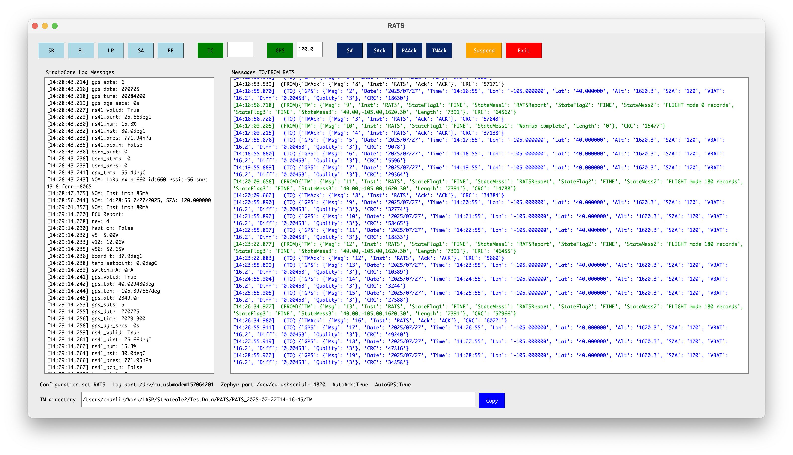
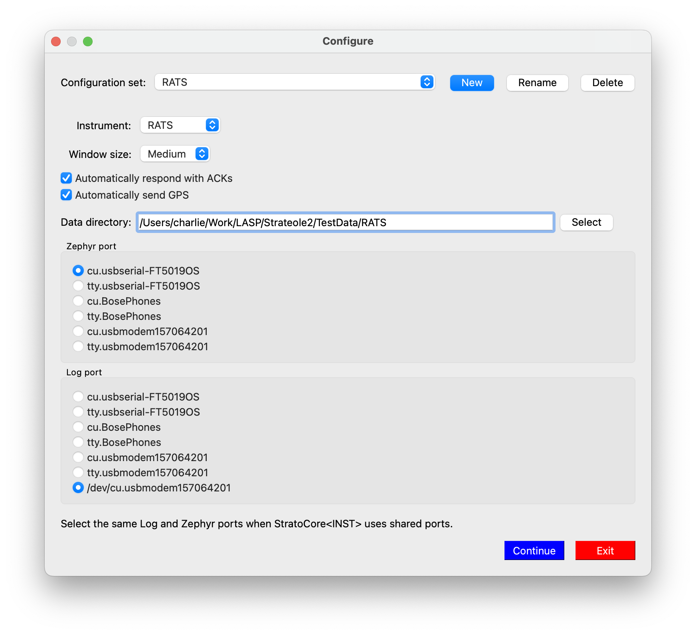
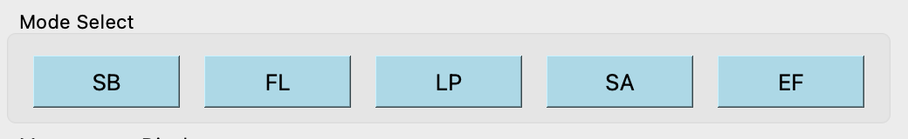
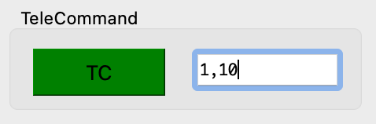
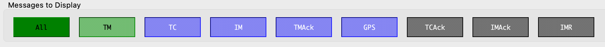
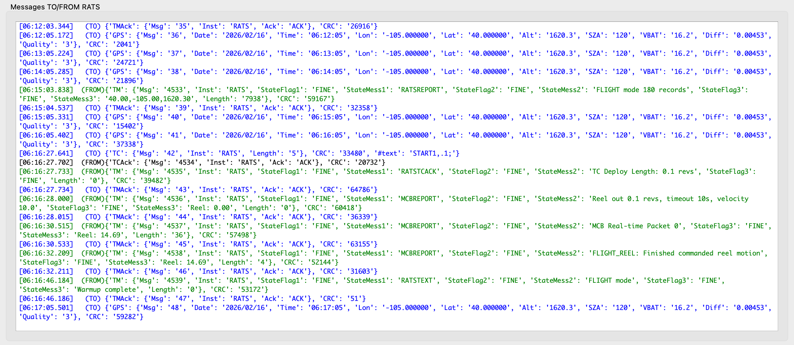
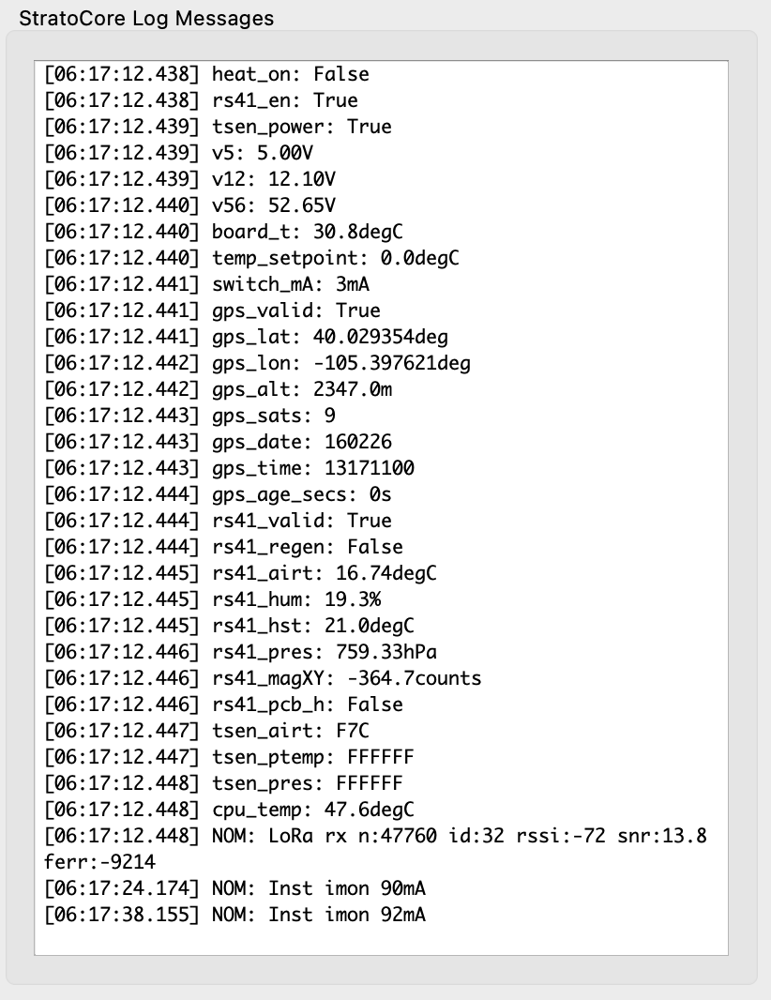

# ZephyrSim Simulator



This repository contains a platform-independent, Python-based ZephyrSim for the CNES Strateole 2 campaign. This simulator adds the ability to receive and display debug messages from LASP instruments over the same serial connection as the XML-based Zephyr communications.

## Quickstart
```sh
pip3 install -r requirements.txt
python3 ZephyrSim.py
```

## Interface

The simulator uses the `PyQt6` library to provide multiple input and output windows 
that allow the user to interact with the instrument under test.

### Startup

On startup, the user has the option to load a previously saved configuration or to create a new configuration. 
The configuration includes the serial ports to use for Zephyr and debug communication, the instrument under test, 
and whether to automatically respond with ACK messages.



Example ports: (Windows) `COM3`, (Linux) `/dev/ttyUSB0`, (MacOS) `/dev/cu.usbmodem165659901`

If the user selects "Automatically respond with ACKs?" prompt, then in response to `S`, `RA`, and `TM` XML messages, 
the simulator will send affirmative `SAck`, `RAAck`, and `TMAck` messages respectively. This is the default option. 
Otherwise, the user must manually send these commands.

### Mode Selection

The instrument Zephyr mode is selected in the _Mode Select_ box.



## Telecommands

The _TeleCommand_ box contains buttons for sending common telecommands to the instrument. If the telecommand takes
parameters, they are included as comma-separated values. The terminating semicolon is not entered; it is automatically appended 
when the command is sent. Either press the TC button or hit Enter to send the command.



## Display Filters

The _Display Filter_ box contains checkboxes for filtering the XML and debug messages shown in the Instrument Output window.
The XML message types are based on the Zephyr XML message types. By default, all message types are shown. Unchecking a message
type will hide messages of that type from the Instrument Output window, but they will still be logged to the session files.
The message filter selections are saved in the configuration and will persist across sessions. 



### Viewing Instrument Output

There are two windows viewing the instrument behavior: _StratoCore Log Messages_, and _Messages TO/FROM \<instrument\>_
(See the first screenshot above for examples of each).

The _Messages_ window displays the complete communication between the Zephyr OBC and the instrument.



The _Log Messages_ window displays the log messages that are received from the instrument over the Teensy USB serial port. 
These messages are not part of the Zephyr communication, but are used for software development. Although
these messages are still transmitted during remote flight operations, the serial port will not be connected to
any devices.



## Log File Structure

Each time a ZephyrSim Simulator session is successfully started, a directory under the `sessions/` directory is created. Each session's 
directory will be named according to the date and instrument: `INST_DD-Mmm-YY_HH-MM-SS/`.

### Session Contents

`INST_CMD_DD-Mmm-YY_HH-MM-SS.txt`: logs all of the commands sent to the instrument

`INST_DBG_DD-Mmm-YY_HH-MM-SS.txt`: logs all of the debug messages received from the instrument

`INST_XML_DD-Mmm-YY_HH-MM-SS.txt`: logs all of the XML messages received from the instrument

`TM`: directory containing individual, timestamped files for each telemetry message in the same format as found on the CCMZ

### Example File Structure

```
sessions/
|---RACHUTS_04-Jun-20_12-04-32/
|   |   RACHUTS_CMD_04-Jun-20_12-04-32.txt
|   |   RACHUTS_DBG_04-Jun-20_12-04-32.txt
|   |   RACHUTS_XML_04-Jun-20_12-04-32.txt
|   |---TM/
|       |    TM_04-Jun-20_12-04-37.RACHUTS.dat
|       |    TM_04-Jun-20_12-04-43.RACHUTS.dat
|---LPC_05-Jun-20_13-07-32/
|   |   LPC_CMD_05-Jun-20_13-07-32.txt
|   |   LPC_DBG_05-Jun-20_13-07-32.txt
|   |   LPC_XML_05-Jun-20_13-07-32.txt
|   |---TM/
|       |    TM_05-Jun-20_13-07-37.LPC.dat
|       |    TM_05-Jun-20_13-07-43.LPC.dat
|---etc...
```

## Design

- `ZephyrSim.py`: Main application entry point that initializes the Qt application, sets up the file structure for the session, initializes the GUI and serial processor, and starts the Qt event loop.
- `ConfigDialog` (`ConfigDialog.py`): Startup/configuration dialog that manages saved config sets, opens selected serial ports, and returns the validated runtime config.
- `MainWindowQt` (`MainWindowQt.py`): Main application window (`QMainWindow`) with mode controls, command buttons, display filter controls, and log/output text panes.
- `ZephyrSimGUI` (`ZephyrSimGUI.py`): GUI controller that wires callbacks to `MainWindowQt`, manages simulator UI state, sends outbound messages, and handles display updates.
- `ZephyrSignalBus` (`ZephyrSignals.py`): Shared Qt signal bus (`log_message`, `zephyr_message`, `command_message`) used for decoupled communication between components.
- `SerialProcessor` (`SerialProcessor.py`): Serial I/O processor that consumes `QSerialPort.readyRead` events, parses incoming log/XML/TM data, emits GUI signals, and writes session files.

